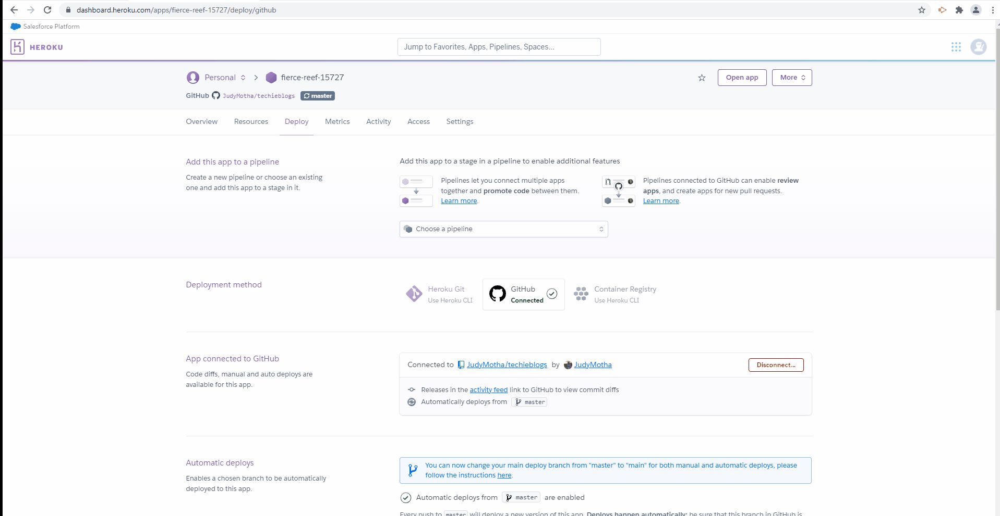

# techieblogs
* The app has a login page for user to create/ enter credentials ,looking at existing blogs and information about the user who left the blog .You are also allowed to create new blogs make updates,deletes  ; comments can also be added.

* GH REPO https://github.com/JudyMotha/techieblogs

* HEROKU  https://fierce-reef-15727.herokuapp.com/

